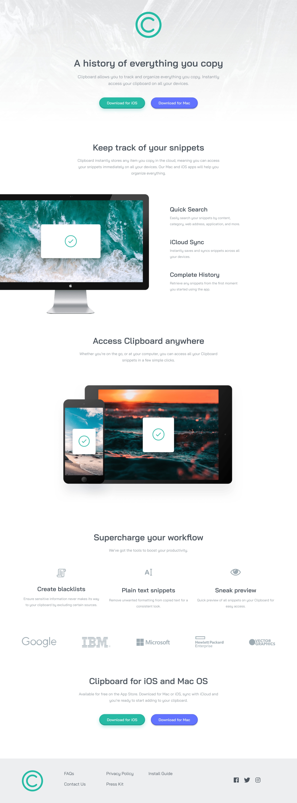
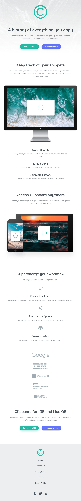
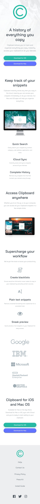

# Table of contents

- [Overview](#overview)
  - [The challenge](#the-challenge)
  - [Screenshot](#screenshot)
  - [Links](#links)
- [My process](#my-process)
  - [Built with](#built-with)
  - [What I learned](#what-i-learned)
  - [Continued development](#continued-development)
  - [Useful resources](#useful-resources)
- [Author](#author)
- [Acknowledgments](#acknowledgments)

## Overview

### The challenge

The users would be able to;

- View the optimal layout for the site depending on their device's screen size.
- See hover states for all interactive elements on the page.

### Screenshot



_A desktop view of the landing page_



_A tablet view of the landing page_



_An image showing the mobile view of the landing page_

### Links

- Solution URL: [See my solution URL here](https://github.com/stephenikuomola/Clipboard-Landing-page)
- Live Site URL: [See the live site URL here](https://stephenikuomola.github.io/Clipboard-Landing-page/)

## My process

### Built with

- Semantic HTML5 markup
- CSS custom properties
- Flexbox
- CSS Grid
- Desktop-first workflow

### What I learned

Before I started this project I was curious about how I would write less mdeia queries. SO after some googling I was able to see how I could make fonts, spacing and images responcive by making use of the clamp(), calc(), min() and max() property. Although the these functions were not used for the images but it was implemented when working with font-sizes, margin and paddings. I found it very fun to work with and it makes the landing page have fluid typography and spacing.

I'll be showing some of the snippets on how I was bale to use this and it was also incorporated with css variables as seen below;

```css
:root {
  --fw-400: 400;
  --fw-600: 600;
  --ff-Bai: "Bai Jamjuree", sans-serif;
  --fs-1: clamp(0.61rem, calc(0.53rem + 0.33vw), 1rem);
  --fs-2: clamp(0.67rem, calc(0.59rem + 0.38vw), 1.12rem);
  --fs-3: clamp(0.75rem, calc(0.66rem + 0.42vw), 1.26rem);
  --fs-4: clamp(0.85rem, calc(0.74rem + 0.48vw), 1.42rem);
  --fs-5: clamp(0.96rem, calc(0.83rem + 0.53vw), 1.6rem);
  --fs-6: clamp(1.09rem, calc(0.94rem + 0.6vw), 1.81rem);
  --fs-7: clamp(1.22rem, calc(1.06rem + 0.68vw), 2.03rem);
  --fs-8: clamp(1.38rem, calc(1.18rem + 0.76vw), 2.29rem);
  --fs-9: clamp(1.54rem, calc(1.33rem + 0.86vw), 2.56rem);
  --fs-10: clamp(1.73rem, calc(1.5rem + 0.96vw), 2.88rem);
  --fs-11: clamp(1.95rem, calc(1.7rem + 1.08vw), 3.25rem);

  --spacing-1: clamp(0.1rem, calc(0.06rem + 0vw), 0.1rem);
  --spacing-2: clamp(0.21rem, calc(0.18rem + 0.08vw), 0.3rem);
  --spacing-3: clamp(0.3rem, calc(0.26rem + 0.17vw), 0.5rem);
  --spacing-4: clamp(0.5rem, calc(0.45rem + 0.25vw), 0.8rem);
  --spacing-5: clamp(0.61rem, calc(0.53rem + 0.33vw), 1.01rem);
  --spacing-6: clamp(0.9rem, calc(0.8rem + 0.5vw), 1.5rem);
  --spacing-7: clamp(1.2rem, calc(1.04rem + 0.67vw), 2rem);
  --spacing-8: clamp(1.81rem, calc(1.57rem + 1vw), 3.01rem);
  --spacing-9: clamp(2.4rem, calc(2.08rem + 1.33vw), 4rem);
  --spacing-10: clamp(3.6rem, calc(3.14rem + 2vw), 5.92rem);
  --spacing-11: clamp(4.8rem, calc(4.16rem + 2.67vw), 8rem);
}

.footer > .footer_grid {
  display: grid;
  grid-template-columns: 1fr 1fr 1fr 2fr 1fr;
}
```

### Continued development

I will still be working and learning how to use these CSS math functions in future projects and also use them when dealing with images. My use of the grid will also need some work, and it is what is used in the footer section for this landing page.

### Useful resources

- [Utopia](https://utopia.fyi/) - This helped me make the fluid typography and spacing. I recommend this for setting up your font sizes and spaces.
- [Kevin Powell](https://www.youtube.com/watch?v=wARbgs5Fmuw&t=11s) - This is youtube video by Kevin Powell also helped me with understanding how the clamp() function works.
- [MDN](https://developer.mozilla.org/en-US/docs/Web/CSS/clamp) - You can also check this documnetation as it goes more in-depth into how to use the CSS clamp function.
- [Adli Purdila](https://webdesign.tutsplus.com/courses/a-beginners-guide-to-using-typographic-scales?utm_campaign=yt_tutsplus_SZYx4Jo5S3M&utm_medium=referral&utm_source=youtube.com&utm_content=description) - This short course by Adi Purdila was really fantastic as it helped to show me how to select type scales depending on the type of project which will be carried out. He also talked about some of the tips and tricks of making a scale responsive.
